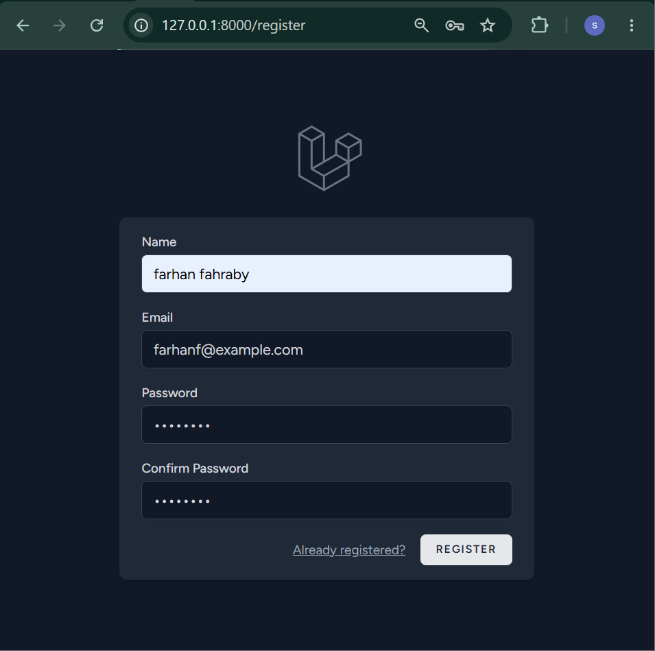
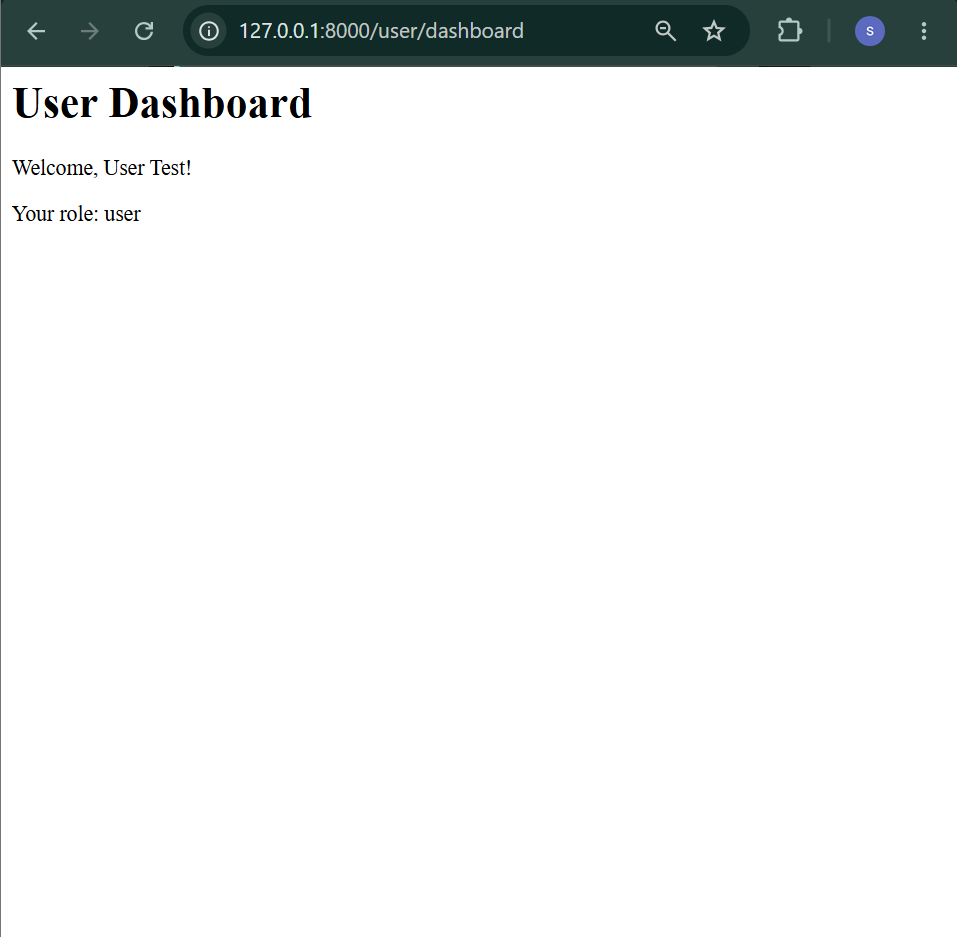
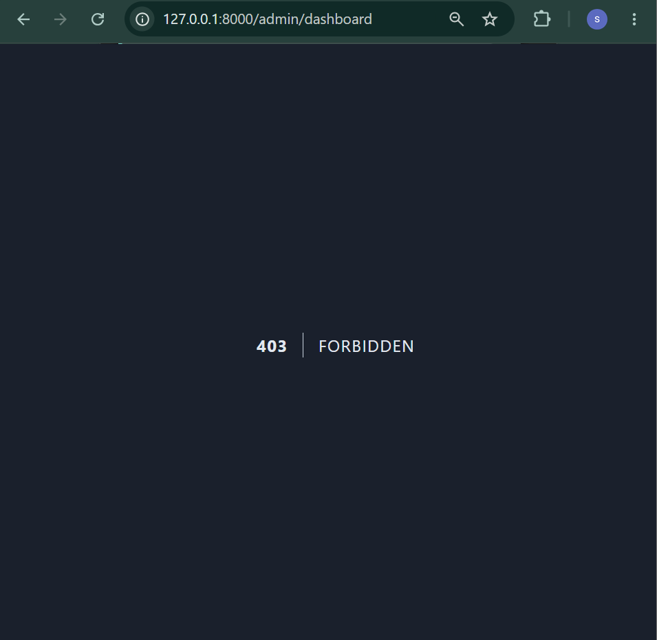

# Week 3: Authentication and Authorization

## 1. Introduction

This document describes the implementation of user authentication and authorization for the Product Management System developed during Week 3 of the Junior Laravel Developer Internship at Yuvaintern.

The main focus of this week was to implement a secure authentication system, define user roles, protect routes using middleware, and implement role-based access control (RBAC). The application uses Laravel Breeze with Blade and Alpine.js as the authentication scaffolding.

The system provides two user roles: `admin` and `user`. Administrators can access the admin dashboard, while regular users are restricted from accessing administrator-only routes.

---

## 2. Week 3 Objectives

The objectives of Week 3 were:

* Implement user registration and login.
* Implement logout functionality.
* Use Laravel Breeze for authentication scaffolding.
* Implement user roles.
* Implement role-based authorization.
* Create middleware to protect administrator routes.
* Create an administrator dashboard.
* Create a regular user dashboard.
* Test unauthorized access.
* Document security considerations and implementation results.

---

## 3. Authentication Setup

Laravel Breeze was selected to provide the basic authentication functionality of the application.

The Breeze package was installed using:

```bash
composer require laravel/breeze --dev
```

The authentication scaffolding was then generated using:

```bash
php artisan breeze:install
```

The following options were selected during installation:

* Stack: Blade with Alpine.js
* Dark mode: Enabled
* Testing framework: Pest

After installing Breeze, the frontend dependencies were installed and built:

```bash
npm install
npm run build
```

Laravel Breeze generated the required authentication routes, controllers, views, and supporting files for registration, login, and logout.

---

## 4. User Registration

The registration page is available at:

```text
/register
```

Users can register by providing:

* Name
* Email address
* Password
* Password confirmation

### Registration Screenshot



The registration process stores the user information in the `users` table.

The password is not stored as plain text. Laravel automatically hashes the password before storing it in the database.

After registration, the user receives the default role:

```text
user
```

This prevents newly registered users from automatically becoming administrators.

---

## 5. Login and Logout

Laravel Breeze also provides login and logout functionality.

The login page is available at:

```text
/login
```

Users authenticate using their registered email address and password.

After successful authentication, Laravel maintains the authenticated user's session and makes the user information available through Laravel's authentication system.

For example:

```php
Auth::user()
```

can be used to access the currently authenticated user.

Logout functionality is also provided by Laravel Breeze. Users can terminate their authenticated session by logging out of the application.

---

## 6. User Roles

The application uses a simple role-based authorization system.

Two roles are currently available:

```text
admin
user
```

The `role` column was added to the `users` table through a database migration.

The default value is:

```text
user
```

This means that newly registered users are regular users unless their role is explicitly changed by an authorized process.

The `User` model also includes the `role` attribute in its fillable fields:

```php
protected $fillable = [
    'name',
    'email',
    'password',
    'role',
];
```

During testing, two accounts were created:

```text
Admin Test
Email: admin@example.com
Role: admin
```

and:

```text
User Test
Email: user@example.com
Role: user
```

---

## 7. Admin Middleware

A custom middleware named `AdminMiddleware` was created to restrict access to administrator-only routes.

The middleware was generated using:

```bash
php artisan make:middleware AdminMiddleware
```

The middleware checks whether the current user is authenticated and whether the user's role is `admin`.

```php
public function handle(Request $request, Closure $next): Response
{
    if (! $request->user() || $request->user()->role !== 'admin') {
        abort(403);
    }

    return $next($request);
}
```

If the user is not authenticated or does not have the `admin` role, the application returns:

```text
403 Forbidden
```

If the user has the administrator role, the request is allowed to continue.

---

## 8. Middleware Registration

The `AdminMiddleware` was registered in `bootstrap/app.php` using the `admin` middleware alias.

```php
->withMiddleware(function (Middleware $middleware): void {
    $middleware->alias([
        'admin' => \App\Http\Middleware\AdminMiddleware::class,
    ]);
})
```

This allows the middleware to be used with the following alias:

```text
admin
```

---

## 9. Role-Based Access Control

Role-based access control was implemented by combining Laravel's authentication middleware with the custom administrator middleware.

The administrator dashboard route is protected using:

```php
Route::middleware(['auth', 'admin'])->group(function () {
    Route::get('/admin/dashboard', function () {
        return view('admin.dashboard');
    })->name('admin.dashboard');
});
```

There are two important middleware checks:

```text
auth
```

ensures that the user is authenticated.

```text
admin
```

ensures that the authenticated user has the administrator role.

The authorization flow can be represented as:

```text
User
  │
  ▼
Authenticated?
  │
  ├── No ──► Access denied
  │
  ▼
Role = admin?
  │
  ├── No ──► 403 Forbidden
  │
  ▼
Admin Dashboard
```

---

## 10. Admin Dashboard

An administrator dashboard was created at:

```text
/admin/dashboard
```

The dashboard is only accessible to authenticated users with the `admin` role.

The current dashboard contains:

```blade
<h1>Admin Dashboard</h1>
<p>Welcome, Admin!</p>
```

### Admin Dashboard Screenshot


The successful access of the administrator account demonstrates that the `auth` and `admin` middleware allow authorized administrators to access the protected route.

---

## 11. User Dashboard

A separate dashboard was created for regular users at:

```text
/user/dashboard
```

The route is protected by authentication middleware:

```php
Route::middleware('auth')->group(function () {
    Route::get('/user/dashboard', function () {
        return view('user.dashboard');
    })->name('user.dashboard');
});
```

The dashboard displays the authenticated user's name and role:

```blade
<h1>User Dashboard</h1>

<p>Welcome, {{ Auth::user()->name }}!</p>

<p>Your role: {{ Auth::user()->role }}</p>
```

### User Dashboard Screenshot



The screenshot demonstrates that a regular user can successfully access the user dashboard after authentication.

---

## 12. Authorization Testing

Several authentication and authorization scenarios were tested.

### Test 1: Registration

A new account was successfully registered through the Laravel Breeze registration page.

Expected result:

```text
Registration successful
```

The user was created with the default role:

```text
user
```

---

### Test 2: Admin Access

The administrator account was used to access:

```text
/admin/dashboard
```

Expected result:

```text
Admin Dashboard
Welcome, Admin!
```

The test was successful.


---

### Test 3: User Access

The regular user account was used to access:

```text
/user/dashboard
```

Expected result:

```text
User Dashboard
Welcome, User Test!

Your role: user
```

The test was successful.


---

### Test 4: Unauthorized Admin Access

The regular user account was then used to access:

```text
/admin/dashboard
```

Because the account has the `user` role, the `AdminMiddleware` rejected the request.

Expected result:

```text
403 Forbidden
```

The test was successful.



This test demonstrates that users with the `user` role cannot access administrator-only routes.

---

## 13. Security Considerations

Several security considerations were applied during the implementation.

### 13.1 Password Hashing

Passwords are handled by Laravel's authentication system and are stored as hashed values rather than plain-text passwords.

During testing, the password stored in the database appeared as a hash similar to:

```text
$2y$12$...
```

This demonstrates that the original password is not stored directly in the database.

### 13.2 Authentication Middleware

Protected routes use Laravel's `auth` middleware.

This prevents unauthenticated users from directly accessing authenticated pages.

### 13.3 Role-Based Authorization

Administrator routes use an additional `admin` middleware.

Authentication alone is therefore not sufficient to access the administrator dashboard.

The application also checks the user's role.

### 13.4 Default User Role

New users receive the default role:

```text
user
```

This is important because a newly registered user should not automatically receive administrator privileges.

The registration process does not allow users to submit their own role as part of the registration form.

### 13.5 Forbidden Response

When a regular user attempts to access an administrator-only route, the application returns:

```text
403 Forbidden
```

This prevents unauthorized users from accessing the protected administrator functionality.

---

## 14. Challenges and Solutions

### Challenge 1: Assigning the Administrator Role

Initially, updating the user's role using mass assignment did not change the value in the database.

The problem was that the `role` attribute was not included in the `$fillable` property of the `User` model.

The original configuration contained:

```php
protected $fillable = [
    'name',
    'email',
    'password',
];
```

The `role` attribute was then added:

```php
protected $fillable = [
    'name',
    'email',
    'password',
    'role',
];
```

After this change, the administrator role could be assigned successfully.

### Challenge 2: Admin Dashboard View

The application initially returned a view-not-found error when accessing the administrator dashboard.

The view file was checked and the Laravel view cache was cleared using:

```bash
php artisan view:clear
php artisan optimize:clear
```

After clearing the cache and confirming the correct file path, the administrator dashboard was displayed successfully.

---

## 15. What I Learned

During Week 3, I learned how Laravel authentication and authorization work together.

I learned how Laravel Breeze can be used to quickly provide authentication functionality such as registration, login, and logout. I also learned how user roles can be stored in the database and used to control access to specific parts of an application.

Another important concept I learned was middleware. Middleware can be used as a security layer between an incoming request and the application route. In this project, I created a custom `AdminMiddleware` to ensure that only users with the `admin` role could access the administrator dashboard.

I also learned the difference between authentication and authorization. Authentication determines whether a user is logged in, while authorization determines whether the authenticated user has permission to access a specific resource or route.

Testing unauthorized access was also important because it verified that the authorization system was not only working for authorized users but also rejecting users who did not have the required role.

---

## 16. Conclusion

Week 3 successfully implemented authentication and role-based authorization for the Product Management System.

Laravel Breeze was used to provide registration, login, and logout functionality. The application was extended with two user roles, `admin` and `user`.

A custom `AdminMiddleware` was implemented to protect administrator-only routes. The administrator dashboard was successfully accessed by an administrator account, while a regular user attempting to access the same route received a `403 Forbidden` response.

The implementation provides the foundation for more advanced authorization and security features that can be developed in the following stages of the project.
